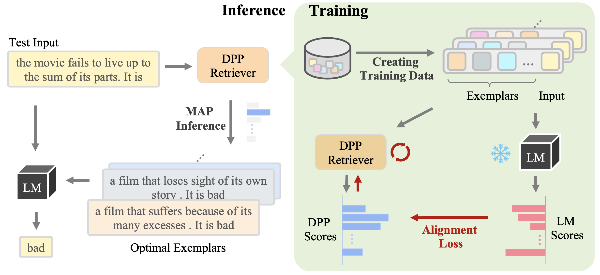

## Compositional Exemplars for In-context Learning
This repository is mainly based on  the source code for CEIL, which is an in-context example retriever proposed in  paper [“Compositional Exemplars for In-context Learning”](https://arxiv.org/abs/2302.05698).Besides, this repo also implements several learning-free (e.g., Random, BM25, TopK-BERT, TopK-DPP) and learning-based retrievers (e.g., [EPR](https://arxiv.org/abs/2112.08633)). 

Following CEIL's settings, we have revised some of the source codes of original CEIL repository to make it run smoothly. If you want to check the original version, please check [CEIL](https://github.com/HKUNLP/icl-ceil/)

Instead of independently retrieving each exemplar (or in-context example), CEIL models the full exemplar sets by learning its joint probability with a conditional DPP, which is further trained to align with the LM score through a contrastive loss. For a given test input during inference, the optimal exemplar set is obtained by the learned DPP retriever through MAP inference.
The black-box LM is frozen during the whole procedure.


## Contents
* [Setup](#setup)
* [Usage](#usage)
* [Modules](#modules)
* [Add a New Task](#add-a-new-task)
* [Citation](#citation)


## Setup
All required packages can be found in ``requirements.txt``. 
You can install them in a new environment with 
```shell
conda create -n icl python=3.8
conda activate icl

# The following line to be replaced depending on your cuda version.
pip install torch==1.10.1+cu113 -f https://download.pytorch.org/whl/torch_stable.html

cd icl_source
pip install -r requirements.txt
# if you don't want to use API from openai, just comment out the `openai` package in `requirements.txt`.
```

Setup WandB for tracking the training status for `EPR` and `CEIL` in `scripts/run_epr.sh` and `scripts/run_dpp_epr.sh`:
```shell
export WANDB_API_KEY=YOUR_WANDB_API_KEY
export WANDB_PROJECT=YOUR_PROJECT_NAME
export WANDB_ENTITY=YOUR_TEAM_NAME
```

**Notice**
- Due to compatibility issues with the `datasets` package, you may encounter the following problems when running the code:

1. "can't load load_metric method from datasets" – Please downgrade the version of `datasets` using `pip install datasets==2.0.0`
2. "...path can't contain **..." – Please upgrade `datasets` using `pip install -U datasets`

- If you encounter problems about dataset split, please check whether "dataset_path" of index_data and   is specified in the corresponding config file

### Usage
Given an index dataset (by default the training set) and an test dataset (by default the validation set), original ceil repository include scripts to run six in-context example retrievers under `scripts/`:
- `run_random.sh`: random retrieve;
- `run_bm25.sh`: sparse retrieve with BM25;
- `run_dense.sh`: dense retrieve with BERT encoder;
- `run_dense_dpp.sh`: dense retrieve with BERT encoder, considering diversity between examples;
- `run_epr.sh`: the learning-based retriever trained to retrieve a better singleton in-context example [(Rubin et al., 2022)](https://arxiv.org/abs/2112.08633);
- `run_ceil.sh`: our proposed learning-based retriever. You need to run `run_epr.sh` first to get an initialization for training CEIL.

The config files and detailed explanation of each argument can be found in `configs/`.

---
For debugging, we have decomposed the scripts `run_epr.sh` and `run_ceil.sh`, which can be found in `./my_scripts`. We recommend you to run those scripts step by step to ensure a correct implementation.
- `EPR`, please execute scripts in this order
bm25 -> scorer -> retriever_trainer-> dense_retriever-> inference

- `ceil`, please execute scripts in this order(All scripts related to ceil are prefixed with "ceil_")
0retrieve -> scorer -> trainer -> 1retrieve -> inference

## Modules
1. `bm25_retriever.py`: retrieve examples from training set with bm25, saved json will have additional field:
    - `ctxs`: a single in-context example sequence which can be directly used in `inferencer`. This is a idx list and each idx specifies the position of an example in the index (e.g., training set). 
    - `ctxs_candidates`: multiple in-context example sequences which can be used to train a dense retriever by further running `scorer` and `retriever_trainer`. This is a list of idx list.
2. `dense_retriever.py`: similar as `bm25_retriever` but retrieve examples with embed model, which is specified in `configs/dense_retriever.yaml`.
3. `scorer.py`: scoring each candidate in `ctxs_candidates` and reranking `ctxs_candidates` based on the scores to create a training data. 
4. `retriever_trainer.py`: train a dense retriever based on the ordered `ctxs_candidates` by contrastive learning.
5. `inferencer.py`: in-context learning inference with pre-retrieved in-context examples (i.e., `ctxs`) and report the final metric.

When using a local huggingface model as inferencer LM, both `scorer` and `inferencer` use `accelerate` to run on multiple GPUs in parallel.
For API-based inferencer, we also support `multiprocessing` api calls. For example, you can input multiple (say n) OpenAI authenticated keys in `openai_keys.txt`, and we will create n processes to run the inference.

For each task, a `dataset_wrapper` is needed, which defines the `q` (input or question) and `a` (output or answer) fields. 
Besides, `qa` and `gen_a` fields are used to define the format of each in-context example and the whole prompt. 

For classification tasks, an additional field is `choices`, which pre-defines the description for each class. During answer generation for classification tasks, we select the class description that has the lowest LM perplexity. 

## Add a New Task
Change the task by modify `task_name` argument, and the current available tasks are `sst5, mrpc, qnli, mnli, cmsqa, swag, webqs, geoquery, nl2bash, mtop, break, smcalflow`.
It's easy to add a new task with this repo. You can take the following steps:
6. (Optional) Define a dataset script under `src/hf_datasets` if the dataset is not available in [Huggingface Datasets](https://huggingface.co/datasets).
7. Create a file under `src/dataset_readers/dataset_wrapper`, and define several interfaces of getting question (task input), answer (task output) and prompt, which will be used by different dataset_readers (e.g., `base_dsr`, `inference_dsr`).
8. (Optional) Define the task metric under `src/metrics` if you have ground-truth outputs for your test dataset.

## Transfer LLM
If you want to change either scorer LLM or downstream inferencer LLM, just change the "model name" config specified in scorer related or inferencer related scripts.
For different model architectures, you may need to change loading method specified in the function `init_model_dataloader` of `./inferencer.py`